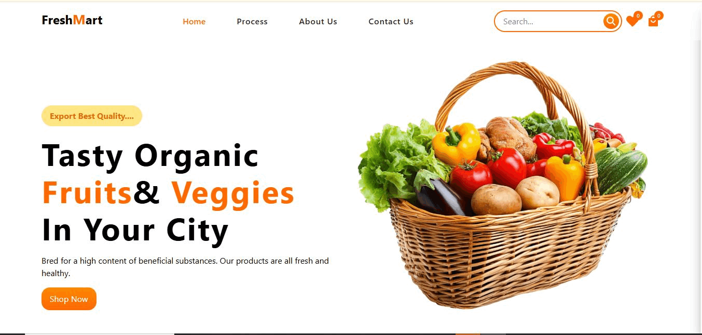
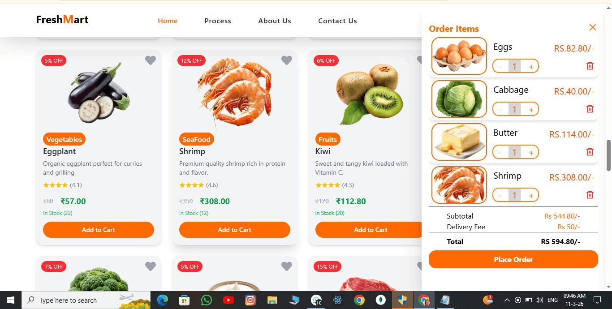

# 🍔 FoodHouse – E-Commerce Web App

FoodHouse is a modern E-Commerce web application built using React, Tailwind CSS, and Redux Toolkit.
It provides a clean and responsive UI where users can browse food items and add them to the cart.

This project focuses on frontend development, state management, and responsive UI design.

## 🚀 Features

🛒 Add to Cart Functionality using Redux Toolkit

⚡ Fast and Interactive UI built with React

🎨 Modern Responsive Design using Tailwind CSS

🔄 State Management with Redux Toolkit

📱 Responsive layout for different screen sizes

## 🛠️ Tech Stack

- React.js – Frontend library

- Tailwind CSS – Styling and responsive UI

- Redux Toolkit – State management

- JavaScript (ES6) – Application logic
## 🌐 Live Demo

https://food-house-lake.vercel.app/
## 📂 GitHub Repository

https://github.com/sachin-lkr/FoodHouse

## 📸 Project Preview

## 📦 Installation

1. Clone the repository

- git clone https://github.com/sachin-lkr/FoodHouse

2. Go to project folder

 - cd FoodHouse

3. Install dependencies

 - npm install

4. Run the project

 - npm run dev
## 📌 Current Features

- Product listing UI

- Add to cart functionality

- Cart state management with Redux

- ❤️ Wishlist feature
  
- 🗂 Product filtering

## 🔜 Upcoming Features

- 🔍 Search functionality (Coming soon)

- 💳 Checkout system

## 👨‍💻 Author

Sachin Kumar
Frontend Developer

GitHub:
https://github.com/sachin-lkr
